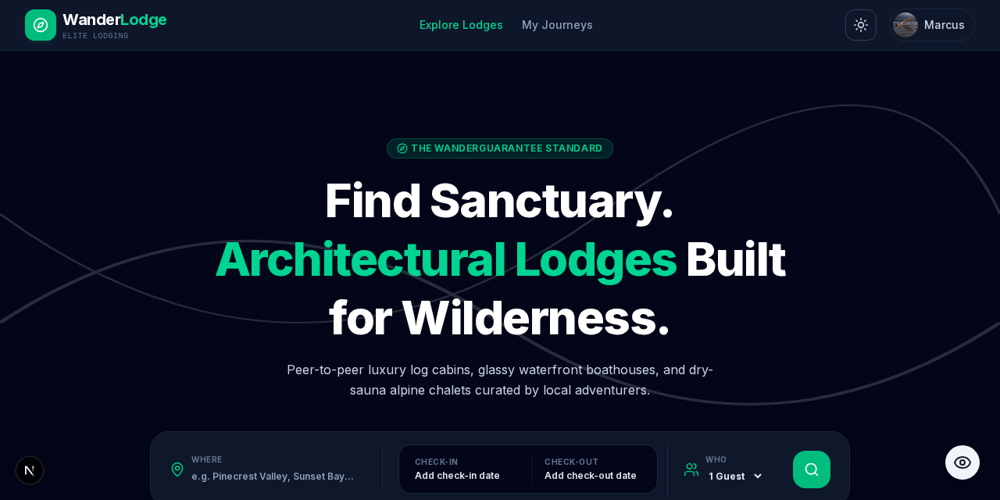
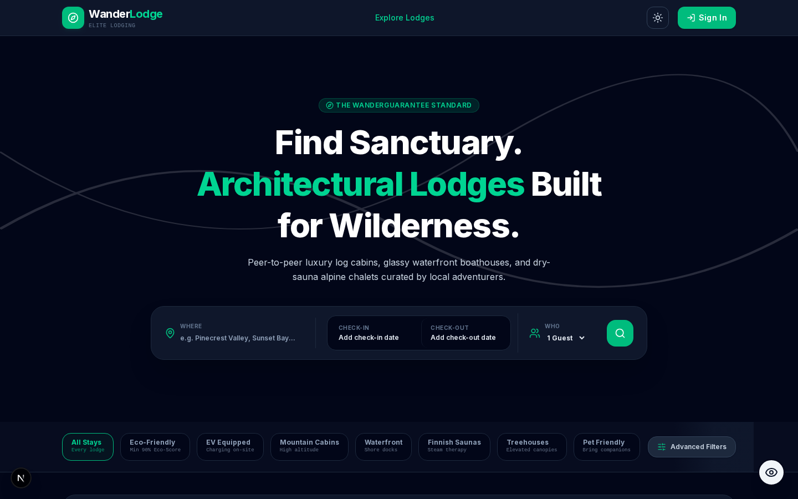
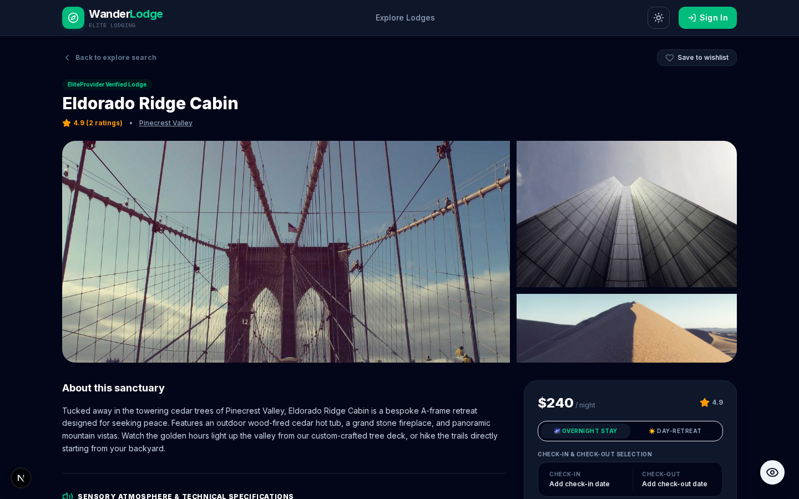
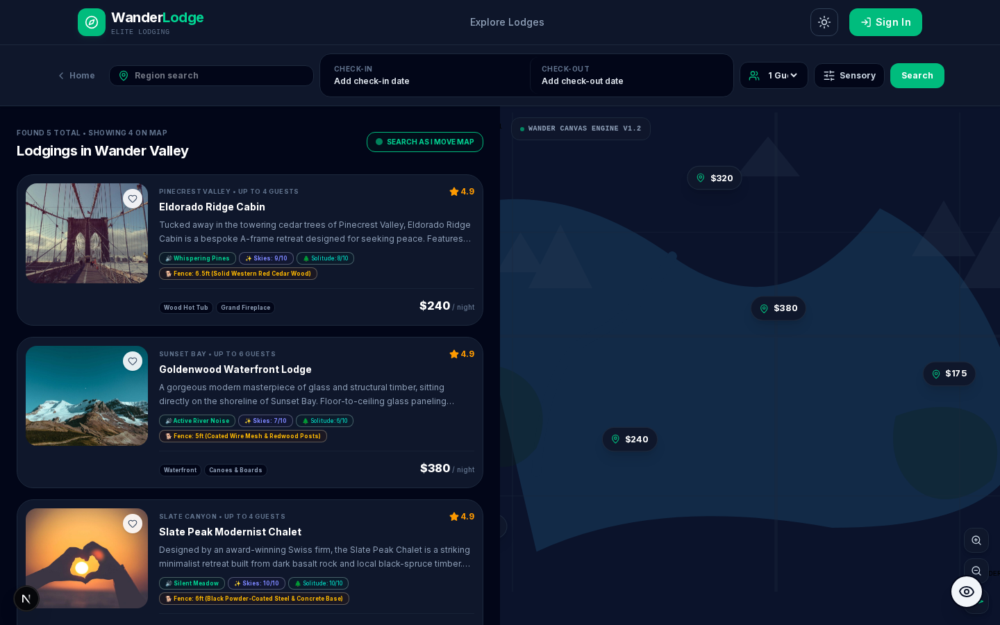
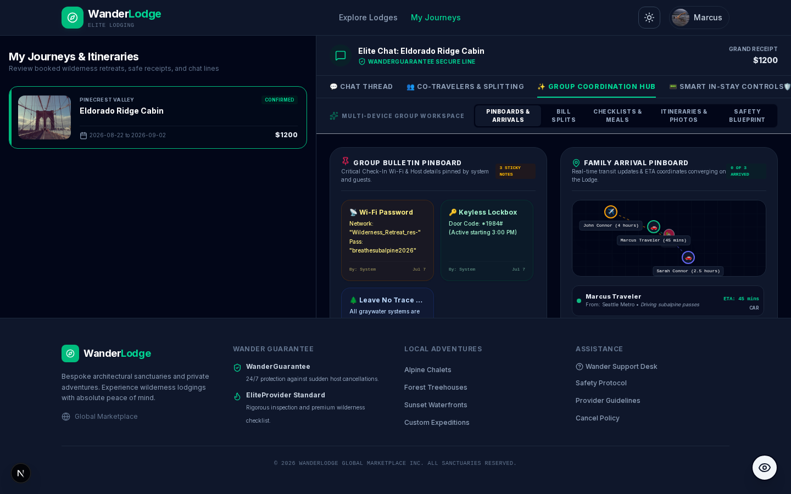

# WanderLodge

Peer-to-peer marketplace for subalpine cabins and lodges. Search sensory-scored stays, book as a traveler or host as a provider, then run a trip workspace with group expenses, in-stay cabin controls, and a wilderness log.

[](https://wanderlodge-taupe.vercel.app)
[](https://github.com/devtechedge/wanderlodge/actions/workflows/ci.yml)
[](https://nextjs.org/)
[](https://www.typescriptlang.org/)
[](https://tailwindcss.com/)
[](LICENSE)

---

## Live Demo

**https://wanderlodge-taupe.vercel.app**

> **Status:** Portfolio demo. Listings and bookings live in an in-memory JSON store (`/tmp` on Vercel, so writes reset). Gemini herb/Q&A/adventure calls fall back to canned payloads when `GEMINI_API_KEY` is unset. Auth is an unsigned demo cookie, not JWT or NextAuth. Payments are simulated.

Demo accounts (password `password123`):

| Role | Email |
|------|-------|
| Traveler | `marcus@wanderlodge.com` |
| Provider | `evelyn@wanderlodge.com` |

This is the **only** public repo for the project.

---

## Screenshots

<p align="center">
  
</p>

| Explore | Property |
|---------|----------|
|  |  |

| Search | Trip workspace |
|--------|----------------|
|  |  |

---

## Features

- Curated lodge grid with category chips, eco-score, and EV badges
- Search + map with amenity, price, guest, and sensory filters (decibel, astrophotography, solitude, fragrance-free)
- Traveler / provider demo auth with a one-click role switch
- Booking card: nights, 50% day-retreat, pantry upgrades, 30/70 deposit split
- Trip workspace: host chat, co-traveler expense split, in-stay cabin controls, wilderness log
- Optional Gemini botanist / concierge — mocked on the public demo

---

## Tech Stack

| Layer | Technology |
|-------|------------|
| Frontend | Next.js 15 (App Router), React 19, TypeScript, Tailwind 4 |
| Motion | Motion (`motion/react`) |
| Data | JSON file store in `lib/db.ts` (not Prisma, not Mongo) |
| Auth | HttpOnly user-id cookie (`lib/session.ts`) — demo only |
| AI | Optional `@google/genai` with canned fallback |
| Hosting | Vercel |
| CI | GitHub Actions — Vitest, `tsc`, Playwright |

---

## Quick Start

```bash
git clone https://github.com/devtechedge/wanderlodge.git
cd wanderlodge
npm install
cp .env.example .env
npm run dev
```

Open **http://localhost:3000**. Gemini is optional.

```bash
npm test
npm run typecheck
npx playwright install chromium
npm run test:e2e
```

---

## Security

Portfolio demo: public passwords, unsigned session cookie, ephemeral JSON on Vercel. Details: **[SECURITY.md](SECURITY.md)**.

---

## License

MIT. See [LICENSE](LICENSE).
